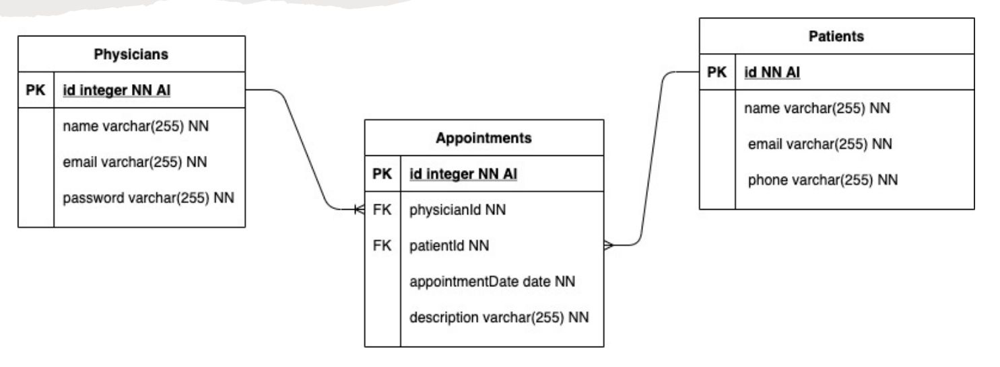

# Gestor Médico API

Aplicação construída como atividades avaliativas da disciplina de *Tópicos Especiais em Algorítmos* do curso de *Tecnologia em Análise e Desenvolvimento de Sistemas*, com o objetivo de servir como API REST para um sistema de gestão de consultas médicas, utilizando a plataforma **Node.js**.

Há 3 ciclos de entrega:

- Inicialização do projeto e configuração do banco de dados com *Sequelize*: [enunciado](./Atividade 02 - Criando Migrations e Seeders.pdf) | [1ª atividade](https://github.com/matteizera/Gestor-Medico/releases/tag/Entrega-2)
- Definição dos *models*, das rotas e dos *controllers*: [enunciado](./Atividade 03 - MVC.pdf) | [2ª atividade](https://github.com/matteizera/Gestor-Medico/releases/tag/Entrega-3)
- Validação de campos e autenticação associada com JWT: [enunciado](./Atividade 04 - Middleware.pdf) <!-- | [3ª atividade](https://github.com/matteizera/Gestor-Medico/releases/tag/Entrega-4) -->

## Modelo Relacional

OBS: a entidade *pgusician* acabou sendo implementada como *doctor*.



## Endpoints

Os seguintes *endpoints* foram criados para atender oaos requisitos:

| Path                           | Método | Ação                                                        |
|:-------------------------------|:------:|:------------------------------------------------------------|
| `/doctors`                     | GET    | Listar todos os médicos                                     |
| `/doctors`                     | POST   | Salvar um novo médico                                       |
| `/doctors/:id`                 | PUT    | Atualizar dados do médico com ID `:id`                      |
| `/doctors/:id`                 | DELETE | Excluir o médico com ID `:id`                               |
| `/patientsd`                   | GET    | Listar todos os pacientes                                   |
| `/patients/search/:name`       | GET    | Listar todos os pacientes que contên `:name` no nome        |
| `/patients/search/doctor/:id`  | GET    | Listar todos os pacientes associados ao médico com id `:id` |
| `/patients`                    | POST   | Salvar um novo paciente                                     |
| `/patients/:id`                | PUT    | Atualizar dados do paciente com ID `:id`                    |
| `/patients/search/patient/:id` | GET    | Listar todas as consultas do paciente com ID `:id`          |
| `/patients/search/doctor/:id`  | GET    | Listar todas as consultas do médicos com ID `:id`           |
| `/appointments`                | POST   | Salvar uma nova consulta                                    |
| `/appointments/:id`            | DELETE | Excluir a consulta com ID `:id`                             |

## Executar o Projeto

Para executar o projeto é necessário ter a versõa 10 ou superior do [Node.js](https://nodejs.org/en/) e o gerenciador de pacotes NPM (incluso na instalação do *Node*) ou o [Yarn (v1)](https://yarnpkg.com/) para configuração dos pacotes de terceiros. Certifique-se também de que o gerenciador de pacote escolhido está disponível através da linha de comando, executando `npm -v` ou `yarn -v`.

Com os *Node.js* configurado, você poderá instalar as dependências a partir do comando:

```bash
# usando o Npm
$ npm install

# usando o Yarn
$ yarn
```

Antes de executar a aplicação, você também deve configurar as variáveis de ambiente, que serão responsáveis por configurações gerais do servidor e pela conexão com banco de dados. Altere então o arquivo `.env`, na raíz do projeto (se após a instalação não houver um arquivo `.env`, crie-o utilizando como base o arquivo `.env.example`). O SGBD utilizado no desenvolvimento foi o [PostgreSQL](https://www.postgresql.org/), por isso, se você não possui uma versão instalada em sua máquina, é possível fazer uso da versão containerizada, em Docker, através do comando `docker-compose up`.

Para saber se o banco foi configurado com sucesso, execute as rotinas de *migrations* e *seeds*:

```bash
# usando o NPX (acompanha o NPM)
$ npx sequelize db:create      # cria o banco de dados no SGBD
$ npx sequelize db:migrate     # executa as migrações dos esquemas
$ npx sequelize db:seed:all    # (opcional) adiciona dados fakes nas tabelas

# usando o Yarn
$ yarn sequelize db:create     # cria o banco de dados no SGBD
$ yarn sequelize db:migrate    # executa as migrações dos esquemas
$ yarn sequelize db:seed:all   # (opcional) adiciona dados fakes nas tabelas
```

Por fim, para executar o servidor em modo de desenvolvimento (executado pelo pacote *nodemon*), utilize o comando `npm run dev` ou `yarn dev`.
